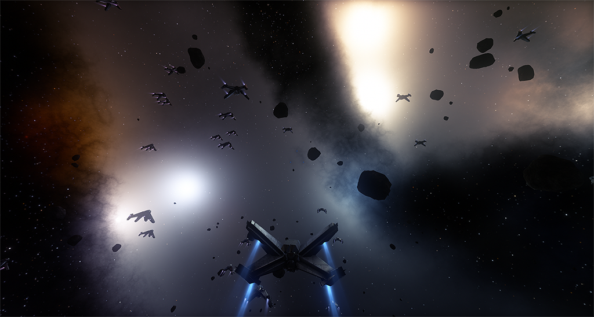

# Limit Theory Redux

Limit Theory Redux is a fork of the now-cancelled open world space simulation game Limit Theory.

This repository continues the game and engine code from the second generation of LT's development, when all work was migrated to C++ and Lua. For the older, C++/LTSL version of Limit Theory, see https://github.com/JoshParnell/ltheory-old.

# Getting Started

## Prerequisites

To build Limit Theory, you'll need a few standard developer tools. All of them are available to download for free.

### Windows

Install the following tools:
- Python: https://www.python.org/downloads/
- Git: https://git-scm.com/downloads
- Git LFS: https://git-lfs.github.com/

If you would like to made changes to the libphx engine, you will also need:
- Visual Studio Community: https://visualstudio.microsoft.com/vs/
- CMake: https://cmake.org/download/

### macOS

Users on macOS will need to install Python, Git, Git LFS, CMake and Xcode.

First, install Xcode using the Mac App store: https://apps.apple.com/us/app/xcode/id497799835

To install the remaining dependencies, we recommend first installing the Homebrew package manager if you haven't already: https://brew.sh/

Once Homebrew is installed, open a **Terminal** window and run the following one-liner:

- `brew install python3 git git-lfs cmake`

### Linux

You should install Python 3, Git, Git LFS and a C++ toolchain using your distro's package manager.

For example, if using Ubuntu 22.04, open a terminal and install the following packages:

- `sudo apt install -y python3 python-is-python3 git git-lfs build-essential cmake`

# Setting up

With the above prerequisites installed, let's get the `libphx` engine set up and ready to run a Lua application. First, open a terminal window (**Git Bash** on Windows).

## Check out the Repository

Use `cd` to change directories to the place where you want to download LTR.

- `cd <path where you want to put the LTR source>` (for example: `~/Desktop` for the desktop)

Before running any other `git` commands, make sure LFS is installed:

- `git lfs install`

You should see `Git LFS initialized` or a similar message. **Important**: if you forget to install and initialize Git LFS, most of the resources will probably be broken, and the whole process will likely fail in strange and mysterious ways. This is a common gotcha with projects that use LFS. See the [Troubleshooting](#troubleshooting) section below for how to resolve this.

Now, you can download the repository:

- `git clone https://github.com/Limit-Theory-Redux/ltheory.git`

## Set up libphx

Next, we will need to get the engine ready to run Lua applications. There are two options, downloading a precompiled binary package, or compiling libphx manually.

### Option 1: Using precompiled binaries

1. Download the latest binary release by going to the `latest` release on GitHub, and downloading the right `bin` package for your platform: https://github.com/Limit-Theory-Redux/ltheory/releases/tag/latest
   * Windows users should download `ltheory-bin-win32.zip`, we recommend other users to skip to [Compiling libphx manually](#option-2-compiling-libphx-manually).
2. Navigate to the directory of the checked-out repository (e.g. `~/Desktop/ltheory` if you cloned to the desktop).
3. Create a new folder named `bin` if it does not exist already.
4. Extract the contents of the zip file downloaded in step 1 into `bin`. The `bin` directory should now contain a number of libraries and executable files, including `lt64`.

Once you've completed these steps, you can skip straight to [Running a Lua App](#running-a-lua-app)

### Option 2: Compiling libphx manually

> As mentioned in [Prerequisites](#prerequisites), both [CMake](https://cmake.org/download/) and [Visual Studio Community](https://visualstudio.microsoft.com/vs/) are required to be installed to compile libphx.

Once you have the repository, the build process consists of two steps (as with other CMake projects): generating the build files, and then building. There is a Python script `configure.py` at the top level of the repository to help you do this easily.

From a terminal in the directory of the checked-out repository, run

- `python configure.py`

This runs CMake to generate the build files. Then, to compile,

- `python configure.py build`

## Running a Lua App

If the compilation is successful, you now have `bin/lt64` (or `bin/lt64.exe` on Windows), which is the main executable. This program launches a Lua script. The intention is for Limit Theory (and all mods) to be broken into many Lua scripts, which would then implement the gameplay, using script functions exposed by the underlying engine.

To launch the default script ('LTheory'), you can run the launcher directly from a terminal / command prompt:

- Windows: `./bin/lt64.exe`
- macOS/Linux: `./bin/lt64`

To launch a specific script, add its name to the end:

- Windows: `./bin/lt64.exe <script name without extension>` (i.e. `./bin/lt64.exe LTheory`)
- macOS/Linux: `./bin/lt64 <script name without extension>` (i.e. `./bin/lt64 LTheory`)

All top-level scripts are in the `script/States/App` directory.

# Troubleshooting

## Unable to load resources such as `Failed to load image from './res/tex2d/metal/01_d.jpg'`

This usually happens if you've cloned the repository without downloading the games' resource files via Git LFS. Open a terminal and run:

- `git lfs fetch`

then:

- `git lfs checkout`

## Debugging in Visual Studio

First, make sure that the CMake project is configured by running the steps above up to `python configure.py`.

Next, open the Visual Studio solution by navigating to `build/LTheory.sln` and opening it. Once the project has loaded, right-click the `lt` project in the Solution Explorer, then select "Set as Startup Project".

To select a Lua script to run, right-click the `lt` project, then select Properties, then Debugging, then change the value in "Command Line Arguments" to the desired Lua script. Leave this blank to launch the default Lua script (`LTheory`).
