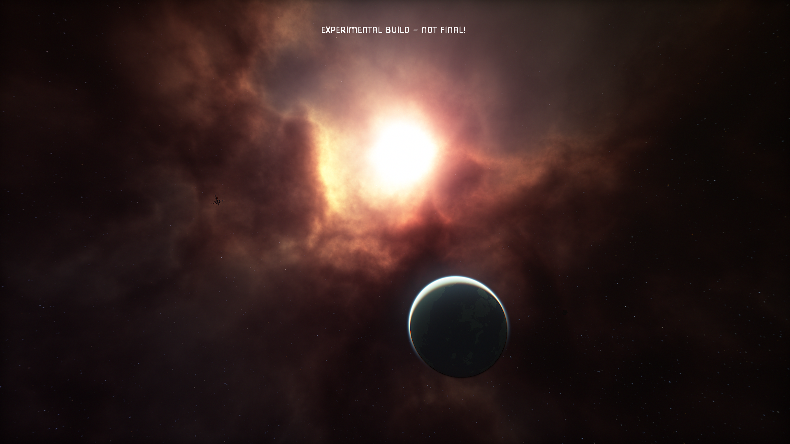
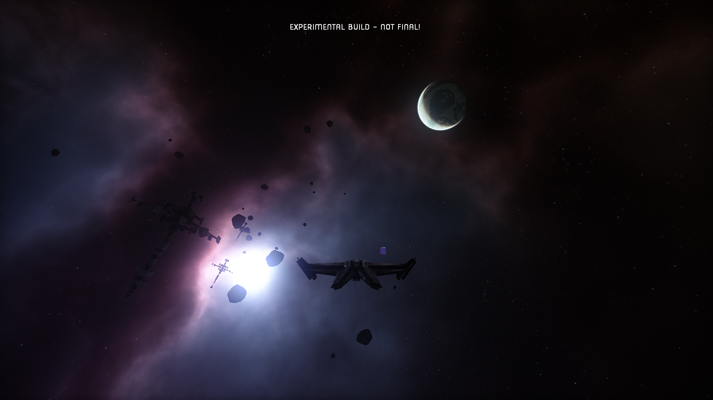
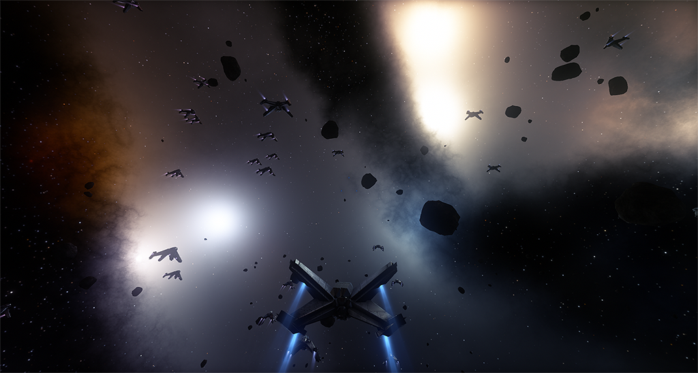

 

---

Limit Theory Redux is a fork of the now-cancelled open world space simulation game Limit Theory.

This repository continues the game and engine code from the second generation of LT's development, when all work was originally migrated to C/C++ and Lua, which we have since ported to Rust and Lua. For the older, C++/LTSL version of Limit Theory, see https://github.com/JoshParnell/ltheory-old.

[Documentation](doc/README.md).

## Contributing to Limit Theory Redux
See [CONTRIBUTING.md](CONTRIBUTING.md) for more information.

## Screenshots

